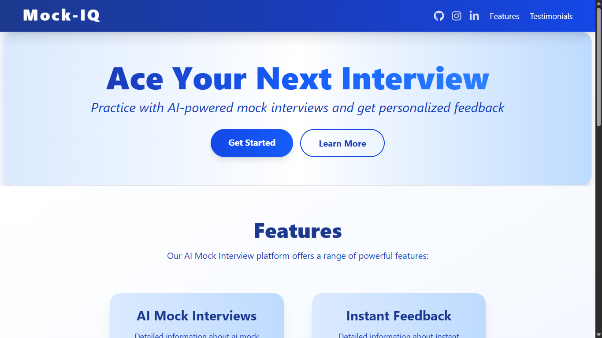
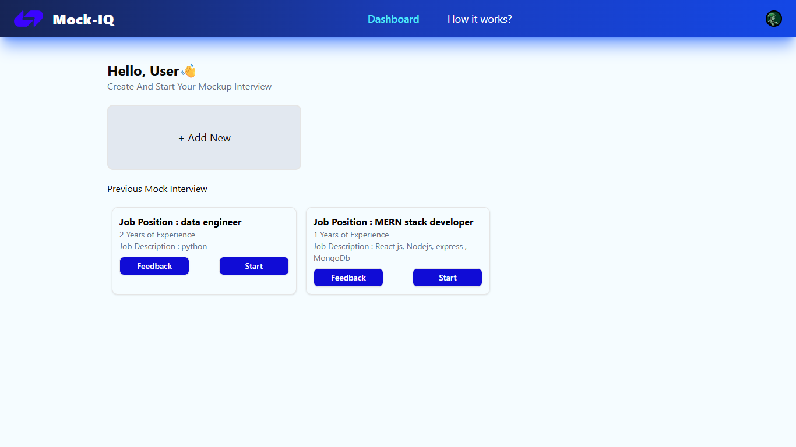
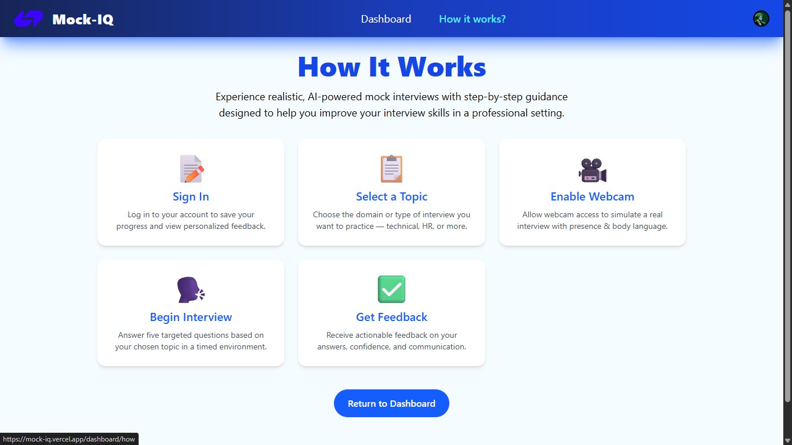
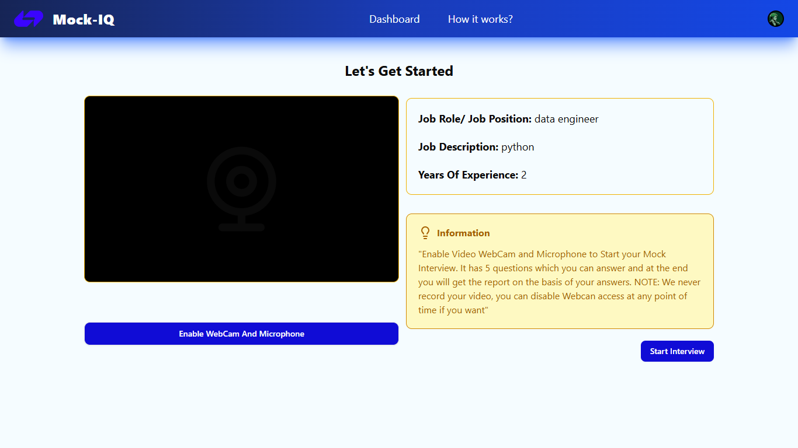
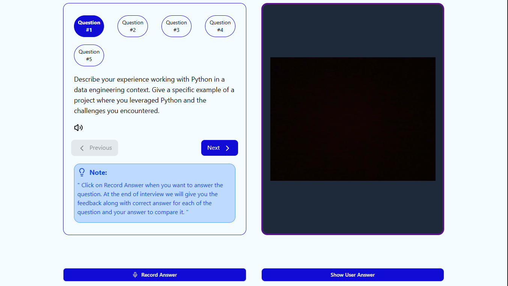
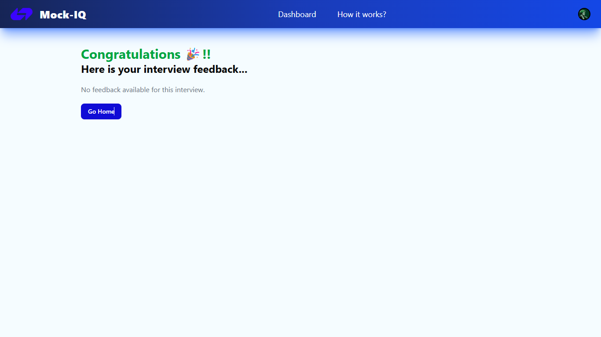

# 🎯 MOCK-IQ

**Mock-IQ** is an **AI-powered mock interview app** that leverages the **Gemini API** to provide realistic, interactive interview experiences.  
It helps users practice both technical and behavioral interview questions with instant feedback and improvement suggestions — so you can ace your next interview with confidence!

🌐 **Live Demo:** [mock-iq.vercel.app](https://mock-iq.vercel.app)

---

## 📚 Topics & Tech Stack

- ✨ **Next.js 15** — React framework for SSR and SSG
- 🗄️ **PostgreSQL** — Robust relational database
- 🔑 **Clerk** — Authentication and user management
- 🌿 **Drizzle ORM** — Type-safe and intuitive database access
- 🤖 **Gemini API** — AI-powered interview simulation and feedback

---

## 🚀 Features

- ✅ AI-generated interview questions and scenarios  
- ✅ Covers both technical & behavioral topics  
- ✅ Instant, actionable feedback with improvement suggestions  
- ✅ User authentication and progress tracking  
- ✅ Responsive and accessible UI  
- ✅ Deployed on Vercel

---

## 📸 Screenshots

### 🏠 Home Page


### 🏠 Dashborad


### 🏠 How It Works?


### 🎤 Interview Session



### 📊 Results Page



## 🛠️ Getting Started

### 1️⃣ Clone the repository
```bash
git clone https://github.com/jay1535/MOCK-IQ.git
cd MOCK-IQ
```

### 📦 Install Dependencies

```bash
npm install

```
## 📦 Install Key Dependencies

Below are the commands to install the key dependencies individually:
```bash
npx shadcn-ui@latest init
npm install @clerk/nextjs
npm install @google/generative-ai
```

### 📄 `.env.local`

Create a `.env.local` file in the root of your project and add the following environment variables:

```env
DATABASE_URL=your_postgres_db_url
NEXT_PUBLIC_CLERK_FRONTEND_API=your_clerk_frontend_api
CLERK_API_KEY=your_clerk_api_key
GEMINI_API_KEY=your_gemini_api_key
```

### 🚀 Run Development Server

After installing dependencies and setting up your `.env.local`, start the development server with:

```bash
npm run dev
```
## 🤝 Contributing

We welcome contributions to **Mock-IQ**!  
If you have ideas for improvements, find a bug, or want to add a feature, feel free to open an issue or submit a pull request.  

### 📝 How to Contribute

1️⃣ Fork the repository and clone it to your local machine:  
```bash
git clone https://github.com/your-username/MOCK-IQ.git
cd MOCK-IQ
```
### 👥 Authors & Acknowledgments

This project is developed and maintained by:

- **Jayant Habbu** — [@jay1535](https://github.com/jay1535)

Special thanks to:

- The developers of [Next.js](https://nextjs.org/), [Clerk](https://clerk.com/), [shadcn/ui](https://ui.shadcn.com/), [Drizzle ORM](https://orm.drizzle.team/), and [Google Generative AI](https://ai.google/discover/generative-ai/) for providing the amazing tools that power this application.
- Everyone who has contributed ideas, feedback, and code to improve **Mock-IQ**!


